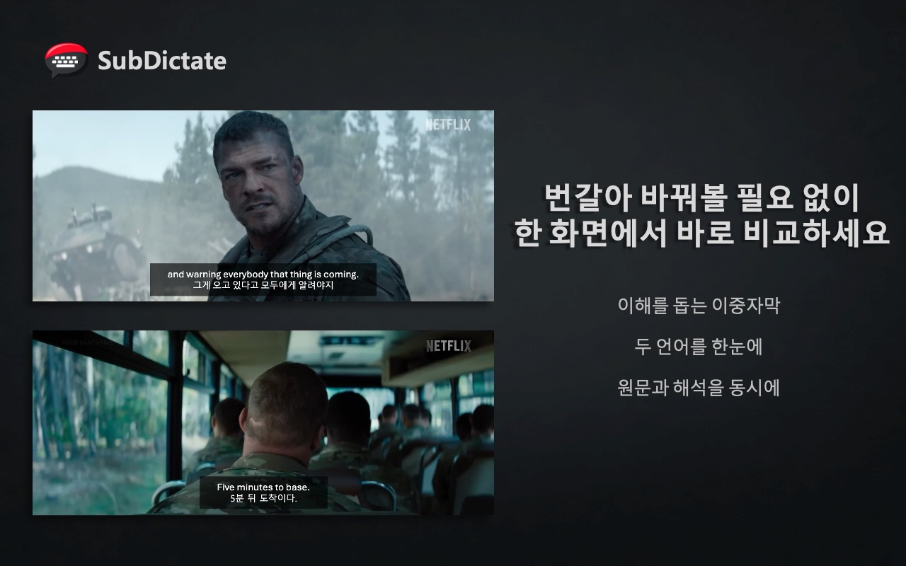
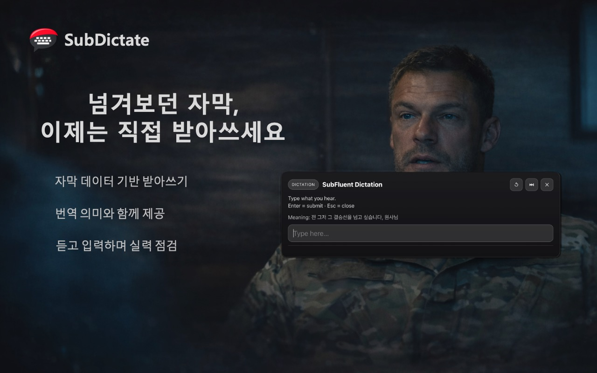
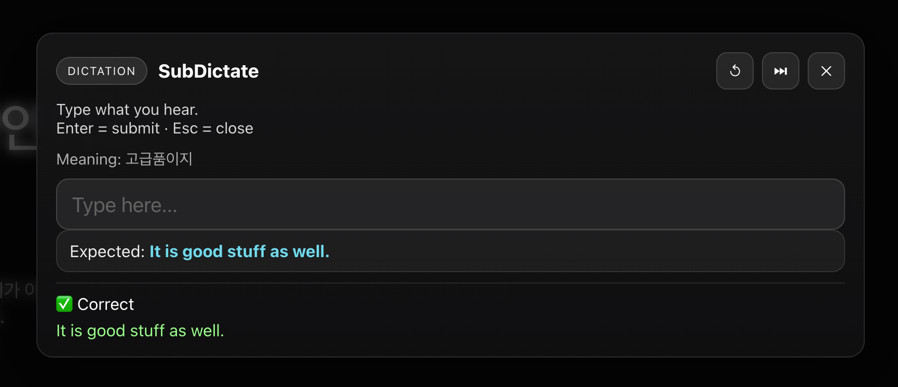
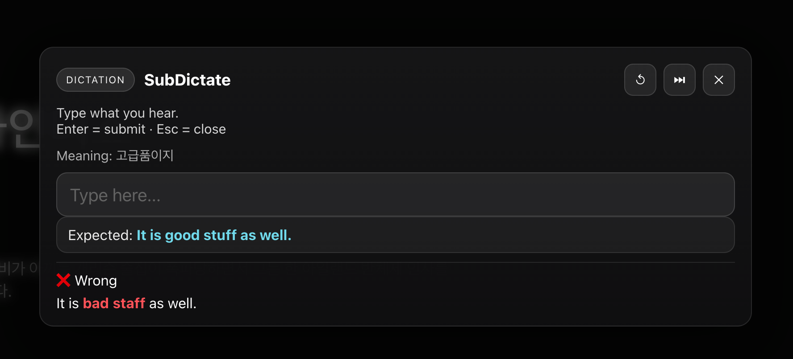
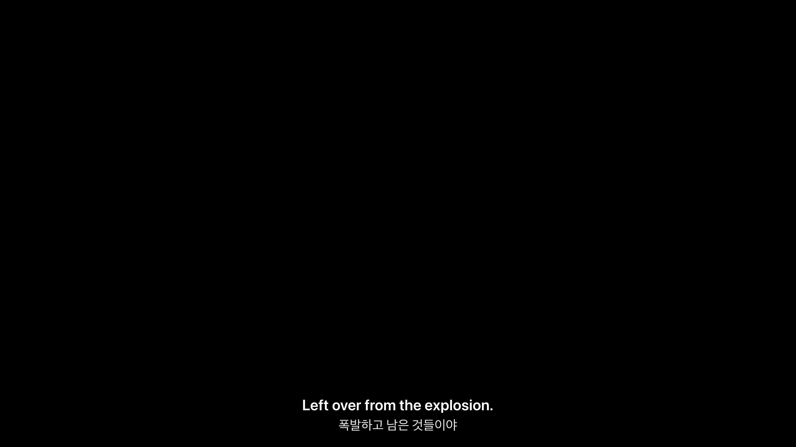
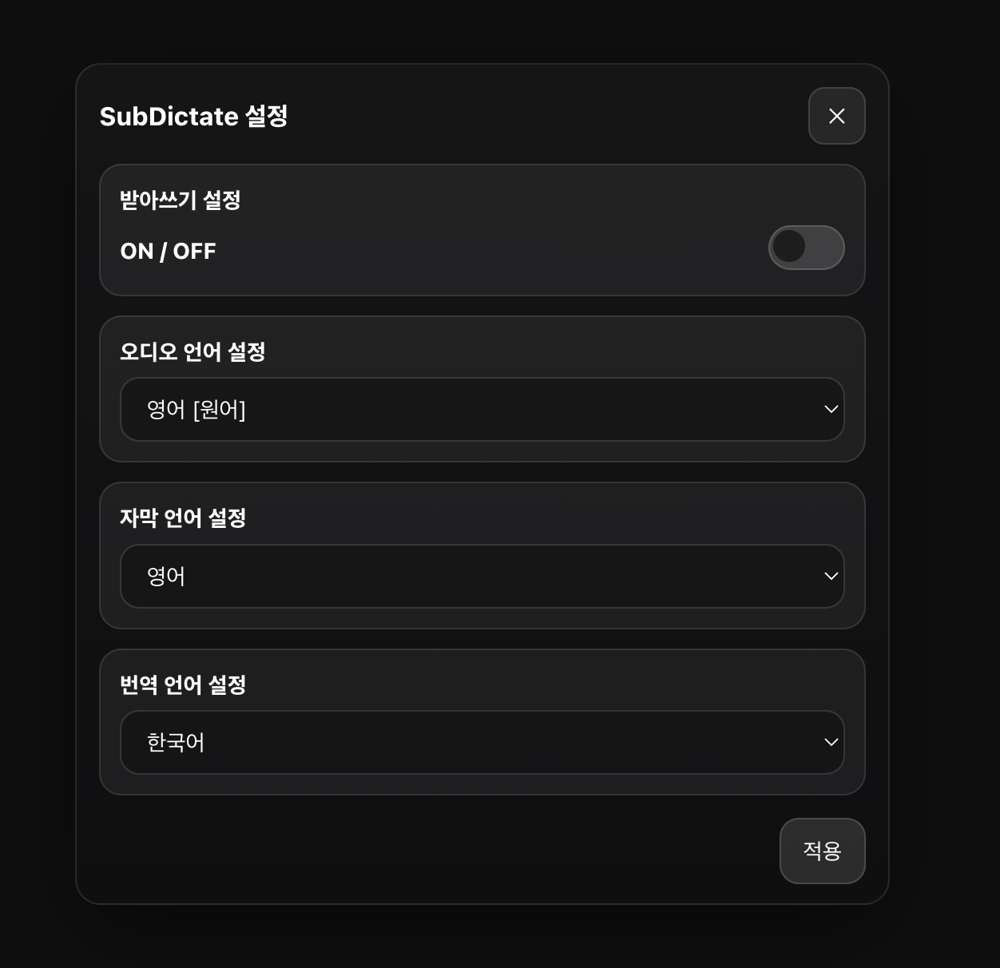
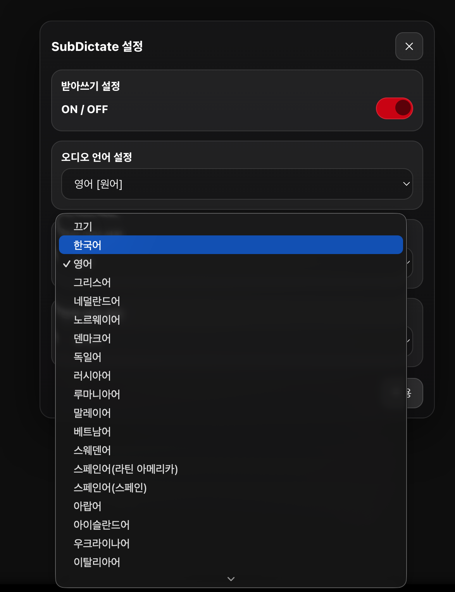
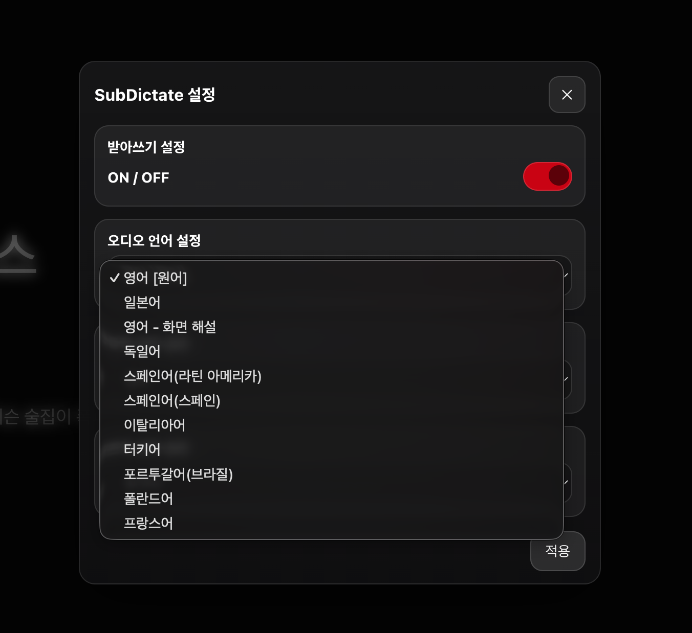

# SubDictate

Netflix 자막 기반 받아쓰기 학습을 지원하는 Chrome Extension

> 단순히 이중 자막을 보는 학습을 넘어, 사용자가 직접 듣고 쓰고 검사하는 받아쓰기형 학습 경험을 제공하는 확장프로그램입니다.

<table align="center">
  <tr>
    <td align="center">
      
    </td>
    <td align="center">
      
    </td>
  </tr>
</table>
---

## 프로젝트 소개

SubDictate는 Netflix 자막을 활용해 받아쓰기 방식의 영어 학습을 할 수 있도록 만든 Chrome Extension입니다.  
기존의 이중 자막 중심 학습에서 나아가, 사용자가 한 줄씩 듣고 직접 입력한 뒤 정답을 확인하는 학습 흐름을 제공하는 데 초점을 맞췄습니다.

## 기획 배경

넷플릭스를 활용한 영어 학습이 많아지고 있지만, 대부분은 이중 자막을 보며 내용을 이해하는 방식에 머물러 있습니다.  
SubDictate는 이를 넘어, 사용자가 직접 듣고 쓰고 검사하는 받아쓰기형 학습 경험을 제공하기 위해 기획한 프로젝트입니다.

## 주요 기능

- 자막 한 줄 단위 받아쓰기 모드
- 자동 일시정지 및 다시 듣기
- 학습용/번역용 이중 자막 오버레이
- Netflix 자막 데이터(TTML) 수집 및 파싱
- 시간대 기반 자막 매칭
- 언어 설정(오디오 / 학습 자막 / 번역 자막) 지원

## 동작 화면

### 받아쓰기 UI

<p align="center">
  
</p>

<p align="center">
  
</p>

### 이중 자막 화면

<p align="center">
  
</p>

### 설정 화면

<p align="center">
  
</p>

<details>
<summary>추가 설정 화면 보기</summary>

<br />

<p align="center">
  
</p>

<p align="center">
  
</p>

</details>

> Netflix DRM 특성상 실제 영상 프레임은 캡처 시 검정으로 표시될 수 있어, UI와 학습 흐름 중심으로 화면을 정리했습니다.

## 기술 스택

| Category | Stack |
|----------|-------|
| Language | TypeScript |
| Build Tool | Vite |
| Platform | Chrome Extension |
| Subtitle Handling | TTML Parsing |
| Runtime | Content Script / Page Hook |

## 동작 구조

SubDictate는 Netflix player와 timed text track을 기반으로 자막 데이터를 수집하고,  
이를 학습용 자막과 번역 자막으로 구성하여 받아쓰기 UI에 연결하는 구조로 동작합니다.

- `pageHook.ts`  
  Netflix player 후킹, audio/text track 제어, TTML 요청 흐름 처리

- `main.ts`  
  오버레이 UI, 받아쓰기 입력 처리, 자막 표시 및 학습 흐름 관리

- `ttmlParser.ts`  
  TTML 자막 파싱 및 cue 데이터 변환

- `contentState.ts`  
  현재 movieId, track 정보, 자막 캐시 상태 관리

```text
Netflix Player
→ Page Hook
→ TTML 수집 / 파싱
→ 자막 매칭
→ Dictation UI Overlay
```

## 개발 시 고충

### 1. 플레이어 라이프사이클 관리
Netflix player의 상태와 참조가 재생 중에도 바뀔 수 있어, `movieId` 변화와 ready 상태를 기준으로 재초기화 시점을 관리해야 했습니다.

### 2. 자막 요청 흐름과 prefetch 구분
초기 prefetch TTML과 실제 요청 이후 도착한 TTML을 구분해야 해서, 자막 요청 흐름을 단순 요청-응답 구조로 처리하기 어려웠습니다.

### 3. TTML 언어 판별의 불안정성
TTML 내부 language 정보가 항상 신뢰할 수 없어, 실제 player에 적용된 timed text track 메타데이터와 요청 순서를 기준으로 자막을 식별하도록 보완했습니다.

### 4. 이중 자막 / 받아쓰기용 자막 매칭 기준
이중 자막과 받아쓰기용 자막이 1:1로 정확히 대응되지 않아, 시간대와 겹치는 구간을 기준으로 자막 매칭 로직을 설계했습니다.  
또한 자막 비교 테스트 페이지를 별도로 제작해 매칭 결과를 반복적으로 확인하며 기준을 보완했습니다.

## 개선 방안

- 받아쓰기 힌트 기능 추가  
  첫 글자, 단어 수, 일부 단어 공개 등 단계형 힌트를 제공하는 기능

- 복습 기능 추가  
  자주 틀린 문장이나 저장한 문장을 다시 학습할 수 있는 복습 목록 기능

- 학습 모드 확장  
  받아쓰기 외에도 쉐도잉, 빈칸 채우기 등 다양한 학습 모드로 확장

## 설치 및 실행 방법

```bash
npm install
npm run build
```

빌드 후 생성된 `dist` 폴더를 Chrome 확장프로그램 개발자 모드에서 불러와 실행할 수 있습니다.

1. Chrome에서 `chrome://extensions` 접속
2. 개발자 모드 활성화
3. `압축해제된 확장 프로그램을 로드합니다` 선택
4. `dist` 폴더 선택

## 디렉터리 구조

```bash
src/
├─ content/
│  ├─ main.ts
│  ├─ pageHook.ts
│  └─ state/
├─ shared/
│  ├─ protocol.ts
│  ├─ ttmlParser.ts
│  └─ util.ts
└─ ...
```
